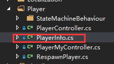

## 登录与注册

后端主要实现用户验证、用户注册、用户属性同步、重复登录提醒、在线人数统计等功能。

前端主要实现玩家属性加载、好友在线提醒等功能。

定义新消息PLAYER_ATTRIBUTE，传递玩家基本属性。

### 后端

首先在数据库新建数据表，在后端新建用于数据库处理的文件夹`DB`。

#### OnRecvLogin.cs

根据用户输入的账号和密码，到玩家表中找是否存在该玩家，返回结果。

同时，向前端发送`SPlayerEnter`消息，允许登录。

从数据库中加载角色属性。

#### OnRecvRegister.cs

实现用户注册逻辑，并与数据库进行对比，提醒用户创建成功或用户名已存在。

#### DB/

在这里实现与数据库交互的逻辑，定义SQL语句。

### 前端

在Player中，新增PlayerInfo类，保存玩家的基本属性。

收到后端`S_PLAYER_ATTRIBUTE`消息后，动态加载到前端UI进行显示。

## Log

- [x] 实现于2018.12.3

- [x] 更新与2018.12.7

## 聊天与历史记录

后端主要对前端的聊天消息进行转发和群发，并异步将聊天记录保存在消息队列中。

前端主要实现了单人聊天、群聊功能，好友在线消息提醒，未读消息缓存等功能。

在聊天消息同步上，使用线程池创建后台线程，每隔一段时间就将当前消息队列同步到数据库中。

### 后端

#### OnlinePlayers

在`OnRecvPlayerEnter`时保存玩家基本属性到`OnlinePlayers`字典中，并向所有玩家发送新在线玩家的属性，便于前端聊天页面的实时更新。

#### ChatHistorySync.cs

作为后台线程，在后台运行时同时运行，主要用于将后端接收到的聊天消息队列**批量**写入数据库中进行持久化。

为了实现聊天记录同步效率最高，本系统进行了如下优化：

1. 每隔一段时间，后台线程会检查当前消息队列是否有新消息，实现批量插入，最大限度的减少与数据库的通信开销。
2. 在SQL语句中，使用`StringBuilder`类而不是`String`类，这样可以避免修改字符串造成的新建字符串开销，此举在插入1w行数据时可以提高两倍的速度
3. 在SQL语句中，事先指定命令类型，避免动态加载。

### 前端

#### OnRecChatMessage.cs

实现接收到消息的逻辑，将聊天记录缓存在消息队列中，并提醒当前玩家有新消息。

#### FriendUI

接收新玩家登录消息，并实时更新在线玩家，展示在聊天框中。

#### ChatUI

实现从消息队列中读取其他玩家消息的逻辑，并将用户发出的消息向后端发送。

### Reference

1. [Unity点击鼠标绑定事件](https://www.cnblogs.com/isayes/p/6370168.html)
2. [C#多线程实现](https://www.cnblogs.com/luxiaoxun/p/3280146.html)
3. [前台进程与后台进程区别](https://www.c-sharpcorner.com/UploadFile/ff0d0f/working-of-thread-and-foreground-background-thread-in-C-Sharp730/)

## 市场与物品交易

### 后端

#### OnRecvLogin.cs

向前端发送商店及所有宝物属性信息，在后端维护了两个字典，`treasureAttributes` 存放所有宝物属性信息，`backMall` 存放商场中的宝物信息，当有新玩家登入时将这两个字典发送给前端，在第一个玩家进入时初始化，之后无需从数据库读，一致维护在内存中。

#### OnRecvBuy.cs

当收到前端消息`C_BUY`后，分别对购买的金币物品和银币物品进行操作

- 对于购买的银币物品，修改数据库中玩家的银币值和背包，返回玩家购买后的剩余银币值和真正购买成功的宝物及其数量
- 对于购买的金币物品，要保证数据的一致性，采用`事务`的方式处理每一个金币商品的购物请求，每个事务修改买家和卖家的金币数、修改宝物的所有者，最后返回玩家购买后的剩余金币值和真正购买成功的金币宝物

#### DB/

实现与数据库交互的逻辑，定义SQL语句，如读取宝物信息、商场宝物信息、修改金币银币值、增删玩家背包等

### 前端

#### AttributeUI.cs

设计了展示物品属性的界面

#### ItemDetailUI.cs

根据用户点击的物品，动态从数据库中加载物品属性，并根据物品的购买类型（金币、银币），加载不同的动画。

同时，实现用户加入购物车或取消的过程。

#### CounterUI.cs

根据用户添加到购物车的物品，分别计算金币、银币物品的总价，并实现用户购买时向后端发送购买请求的逻辑。

由于银币可以丢失，因此直接将用户购买的银币物品加入背包，而金币需要等数据库修改之后再添加。

#### TextMash

在Unity中，提供了富文本类型，可以将图片嵌入文本进行显示（也可以任意设置文本的字体、大小）。

由于宝物在市场中的Layout固定，因此需要使用TextMash来添加金币、银币的标识，让用户知道这是金币购买还是银币购买。

参考资料：

1. [在Unity中将sprite分开为多个GameObject](http://www.unity.5helpyou.com/3625.html)
2. 将普通Sprite制作为Sprite Asset（作为TextMash中图片的来源）：
   - 右键需要制作的Sprite->Create->TextMashPro->Sprite Asset
   - 
3. 新建`TextMash --Text` 的GameObject，并添加Sprite Asset：
   - 
4. 在文本中使用对应的ID即可使用：
   - 
5. 在Script中使用该[GameObject](https://forum.unity.com/threads/from-unity-ui-to-textmeshpro.463619/)，需要添加NameSpace